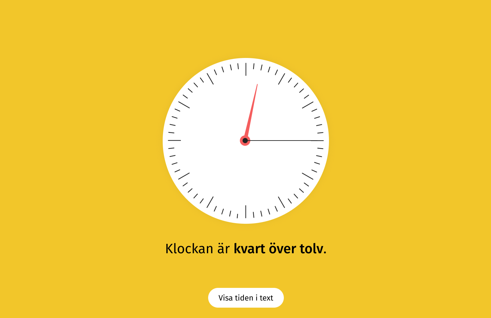

# Around the clock
**En webbApp för att träna och lära sig klockan.**

## Instruktioner
Ditt uppdrag blir att göra en analog clocka med HTML, CSS och JS. 

Den ska på tryck av klockan slumpa ut en tid med 5min upplösning. D.v.s. *10.25*, *14.30*, *15.00* etc, **Inte** *14.23*, *19.19* etc.

Utöver att slumpad tid ska visas på den analoga klockan skall ett textfacit finnas som visas när man klickar på en knapp. Ex. *"Klockan är tjugo minuter över två."*

## Screens
;

Gränssnittet hittar ni även i bifogad figma-fil samt [här](https://www.figma.com/file/C8PFit5PJVnVBIeJse2RMk/Around-the-clock?node-id=1%3A2).

## Levelups
- Skapa ett **digitalt ui** av klockan som du kan byta mellan.

- Gör det valbart att du kan växla mellan siffror på tavlan och inga siffror ( finns sifferlös bakgrund i assets).

- Gör det valbart att ändra till minut-precision istället för 5min precision.

- Generera klockan med en *canvas* istället.

- När du går in på appen ska den visa aktuell tid ( alltså vad klockan är just då).
